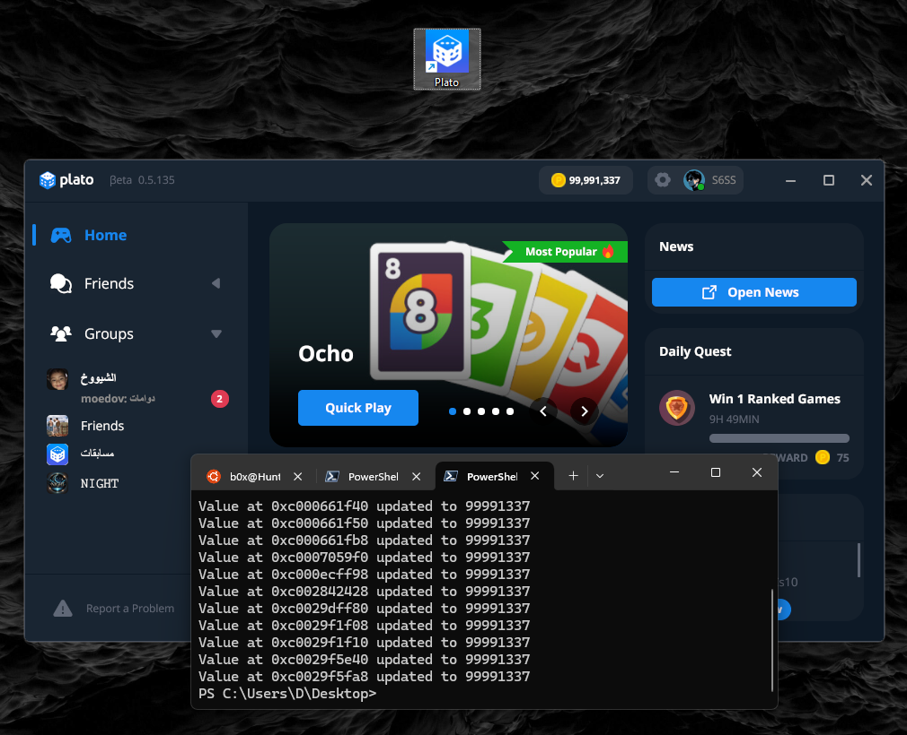

# PlatoMemoryHack

A simple and effective memory scanner for the Plato App, built with Python to track and modify in-game values.
This tool mimics basic Cheat Engine functionality, allowing users to:

-  Scan for specific values in memory (e.g., coins).
-  Track value changes after in-game actions (e.g., purchases).
-  Modify live memory values (e.g., set coins to 99999).

---

## How It Works

1. Launch the **Plato App**.
2. Run the script and enter the current value you'd like to scan.
3. Now go buy something in-game, then press Enter to continue...
4. Enter the new value to filter and confirm matching memory addresses.
5. Set your own custom value to be written into memory.

---

## Current State of Plato App

> As of now, the Plato App does **not** include a marketplace or store system.  
> This means the in-game currency currently has **no actual function**.  
> However, in future updates, if Plato adds spendable features — this tool **could** become useful, unless the game implements proper server-side validation.

---

## Requirements

To install the necessary Python dependencies, run:

<pre>
pip install -r requirements.txt
</pre>

 ---

## About Plato App

This tool is designed for the **Windows desktop version** of the [Plato App](https://platoapp.com/en/download).  
You can download the official game client from the link below:

🔗 **Official Download:** [https://platoapp.com/en/download](https://platoapp.com/en/download)
